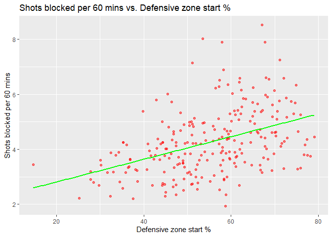

Who Are the Best Defensemen Pairs in the National Hockey League?
================
Michael Vandervelden

``` r
# Load packages 

library(tidyverse)
library(dplyr)
library(effectsize)
library(ggplot2)
```

# Data Acquisiton

This project uses NHL all-strengths defensemen and defensive pair data
from the 2021-2022 regular season. The datasets, in CSV format, can be
found at: <https://www.naturalstattrick.com/playerteams.php?stdoi=oi>

<https://www.naturalstattrick.com/playerteams.php?stdoi=std>

<https://www.naturalstattrick.com/pairings.php>

# Introduction

To win hockey games, it’s of vital importance to keep the puck out of
the net. Consequently, defensemen, and by extension the pair of
defensemen that comprise part of a team’s five skaters, are some of the
most valuable players on the ice. Having even one defensive stalwart on
a team’s roster can have a significant impact on that team’s success.
However, defensemen in the National Hockey League are often considered
the best simply due to their impressive statistics on offense. The
Norris Trophy, awarded annually to the league’s single best defenseman,
is essentially an honour for the defender with the most goals and
assists. Since the role of the defensive pair is to defend their team’s
goal, I wanted to analytically rank the best pairs in the league, based
on both defensive and offensive metrics, while adjusting for influential
factors such as zone start percentage.

# Methods and techniques

I wanted to determine which players made up the best defensive pairs, or
pairings, in the National Hockey League. To do this, I resolved to
assign a numerical score to each individual defenseman, with the sum of
any two defensemen being the aggregate score for a given pairing. This
scoring, as well as any data cleaning and restructuring, was done in
Microsoft SQL Server.

Each score is a simple sum of various offensive and defensive
statistics, where desirable statistics are positive and undesirable
statistics are negative, including Corsi-for %, High Danger Chances for
%, Goals-for %, Expected Goals against, Expected goals for %, Giveaways
per 60 mins, High Danger Chances for per 60 mins, Shots Against per 60
mins, Shots Blocked per 60 mins, Goals for per 60 mins, Takeaways per 60
mins, Shots for per 60 mins, and Goals against per 60 mins.

Since players had their metrics impacted, sometimes significantly, by
high defensive zone start percentages, the impact of these high
percentages had to be quantified and adjusted for.

# Impact of a high defensive zone start percentage

There are four different types of starts a given player can have:
Offensive zone starts, in which the player is deployed for a face-off
behind the opposing teams blue-line; Defensive zone starts, in which the
player is deployed for a face-off behind his own blue-line; Neutral zone
starts, in which the player is deployed for a face-off between the two
blue-lines; and finally on-the-fly starts, where a player comes on to
the ice as the play is still going on. Though neutral zone and
on-the-fly starts comprise the majority of a player’s starts, it is the
percentage of offensive and defensive zone starts that best reflects how
a player is deliberately deployed by their coach.

Before I began my analysis, I suspected that a player with a high
percentage of starts in the defensive zone would have their respective
metrics skewed negatively. This is because they are inevitably spending
more time in their own zone defending while the opposing team has
possession of the puck. To confirm or refute my suspicions, I created a
simple linear regression model for each of the metrics I planned on
using in my rankings, with defensive zone start percentage as the sole
explanatory variable.

``` r
# Read in data
defensemen_data = read_csv("new_defensemen_data.csv")
```

# Plots

``` r
ggplot(data=defensemen_data, mapping=aes(Def_Zone_Start_Pct, CF1)) + geom_point(color='red', alpha=0.5) + geom_smooth(method='lm', se=FALSE, color='green') + labs(title="Corsi-for % vs. Defensive zone start %", x = "Defensive zone start %", y = "Corsi-for %")

ggplot(data=defensemen_data, mapping=aes(Def_Zone_Start_Pct, HDCA_60)) + geom_point(color='red', alpha=0.5) + geom_smooth(method='lm', se=FALSE, color='green') + labs(title="High-danger chances against per 60 mins. vs. Defensive zone start %", x = "Defensive zone start %", y = "High-danger chances against per 60 mins")

ggplot(data=defensemen_data, mapping=aes(Def_Zone_Start_Pct, GF1)) + geom_point(color='red', alpha=0.5) + geom_smooth(method='lm', se=FALSE, color='green') + labs(title="Goals-for % vs. Defensive zone start %", x = "Defensive zone start %", y = "Goals-for %")
 
ggplot(data=defensemen_data, mapping=aes(Def_Zone_Start_Pct, xGA)) + geom_point(color='red', alpha=0.5) + geom_smooth(method='lm', se=FALSE, color='green') + labs(title="Expected goals against vs. Defensive zone start %", x = "Defensive zone start %", y = "Expected goals against")

ggplot(data=defensemen_data, mapping=aes(Def_Zone_Start_Pct, xGF)) + geom_point(color='red', alpha=0.5) + geom_smooth(method='lm', se=FALSE, color='green') + labs(title="Expected goals for % vs. Defensive zone start %", x = "Defensive zone start %", y = "Expected goals for %")

ggplot(data=defensemen_data, mapping=aes(Def_Zone_Start_Pct, Giveaways_60)) + geom_point(color='red', alpha=0.5) + geom_smooth(method='lm', se=FALSE, color='green') + labs(title="Giveaways per 60 mins vs. Defensive zone start %", x = "Defensive zone start %", y = "Giveaways per 60 mins")

ggplot(data=defensemen_data, mapping=aes(Def_Zone_Start_Pct, HDCF1)) + geom_point(color='red', alpha=0.5) + geom_smooth(method='lm', se=FALSE, color='green') + labs(title="High-danger chances for % vs. Defensive zone start %", x = "Defensive zone start %", y = "High danger chances for %")

ggplot(data=defensemen_data, mapping=aes(Def_Zone_Start_Pct, SF_60)) + geom_point(color='red', alpha=0.5) + geom_smooth(method='lm', se=FALSE, color='green') + labs(title="Shots for per 60 mins vs. Defensive zone start %", x = "Defensive zone start %", y = "Shots for per 60 mins")

ggplot(data=defensemen_data, mapping=aes(Def_Zone_Start_Pct, SA_60)) + geom_point(color='red', alpha=0.5) + geom_smooth(method='lm', se=FALSE, color='green') + labs(title="Shots against per 60 mins vs. Defensive zone start %", x = "Defensive zone start %", y = "Shots against per 60 mins")

ggplot(data=defensemen_data, mapping=aes(Def_Zone_Start_Pct, Shots_Blocked_60)) + geom_point(color='red', alpha=0.5) + geom_smooth(method='lm', se=FALSE, color='green') + labs(title="Shots blocked per 60 mins vs. Defensive zone start %", x = "Defensive zone start %", y = "Shots against per 60 mins")

ggplot(data=defensemen_data, mapping=aes(Def_Zone_Start_Pct, GF_60)) + geom_point(color='red', alpha=0.5) + geom_smooth(method='lm', se=FALSE, color='green') + labs(title="Goals for per 60 mins vs. Defensive zone start %", x = "Defensive zone start %", y = "Goals for per 60 mins")

ggplot(data=defensemen_data, mapping=aes(Def_Zone_Start_Pct, Takeaways_60)) + geom_point(color='red', alpha=0.5) + geom_smooth(method='lm', se=FALSE, color='green') + labs(title="Takeaways per 60 mins vs. Defensive zone start %", x = "Defensive zone start %", y = "Takeaways per 60 mins")

ggplot(data=defensemen_data, mapping=aes(Def_Zone_Start_Pct, GA_60)) + geom_point(color='red', alpha=0.5) + geom_smooth(method='lm', se=FALSE, color='green') + labs(title="Goals against per 60 mins vs. Defensive zone start %", x = "Defensive zone start %", y = "Goals against per 60 mins")
```



# Effect size of defensive zone start percentage

As made evident by the plots, a player’s defensive zone start percentage
has a significant impact on several important metrics. In order to
determine how to adjust the effect of these metrics on the final
rankings, I obtained the coefficients and associated p-value for the
effect of defensive zone start percentage on each metric.

``` r
summary(lm(CF1 ~ Def_Zone_Start_Pct, data=defensemen_data))
```

    ## 
    ## Call:
    ## lm(formula = CF1 ~ Def_Zone_Start_Pct, data = defensemen_data)
    ## 
    ## Residuals:
    ##      Min       1Q   Median       3Q      Max 
    ## -10.0054  -2.6002  -0.0413   2.5395   7.9331 
    ## 
    ## Coefficients:
    ##                    Estimate Std. Error t value Pr(>|t|)    
    ## (Intercept)        65.29924    1.05750   61.75   <2e-16 ***
    ## Def_Zone_Start_Pct -0.31319    0.01872  -16.73   <2e-16 ***
    ## ---
    ## Signif. codes:  0 '***' 0.001 '**' 0.01 '*' 0.05 '.' 0.1 ' ' 1
    ## 
    ## Residual standard error: 3.596 on 242 degrees of freedom
    ## Multiple R-squared:  0.5364, Adjusted R-squared:  0.5345 
    ## F-statistic:   280 on 1 and 242 DF,  p-value: < 2.2e-16

``` r
summary(lm(SA_60 ~ Def_Zone_Start_Pct, data=defensemen_data))
```

    ## 
    ## Call:
    ## lm(formula = SA_60 ~ Def_Zone_Start_Pct, data = defensemen_data)
    ## 
    ## Residuals:
    ##     Min      1Q  Median      3Q     Max 
    ## -7.3888 -1.9381  0.0357  1.8571  9.6684 
    ## 
    ## Coefficients:
    ##                    Estimate Std. Error t value Pr(>|t|)    
    ## (Intercept)        24.17706    0.80132   30.17   <2e-16 ***
    ## Def_Zone_Start_Pct  0.14294    0.01418   10.08   <2e-16 ***
    ## ---
    ## Signif. codes:  0 '***' 0.001 '**' 0.01 '*' 0.05 '.' 0.1 ' ' 1
    ## 
    ## Residual standard error: 2.725 on 242 degrees of freedom
    ## Multiple R-squared:  0.2957, Adjusted R-squared:  0.2927 
    ## F-statistic: 101.6 on 1 and 242 DF,  p-value: < 2.2e-16

``` r
summary(lm(xGA ~ Def_Zone_Start_Pct, data=defensemen_data))
```

    ## 
    ## Call:
    ## lm(formula = xGA ~ Def_Zone_Start_Pct, data = defensemen_data)
    ## 
    ## Residuals:
    ##     Min      1Q  Median      3Q     Max 
    ## -49.662 -22.195   0.756  18.968  66.278 
    ## 
    ## Coefficients:
    ##                    Estimate Std. Error t value Pr(>|t|)    
    ## (Intercept)         39.2969     7.2924   5.389 1.68e-07 ***
    ## Def_Zone_Start_Pct   0.3738     0.1291   2.897  0.00412 ** 
    ## ---
    ## Signif. codes:  0 '***' 0.001 '**' 0.01 '*' 0.05 '.' 0.1 ' ' 1
    ## 
    ## Residual standard error: 24.79 on 242 degrees of freedom
    ## Multiple R-squared:  0.03351,    Adjusted R-squared:  0.02951 
    ## F-statistic:  8.39 on 1 and 242 DF,  p-value: 0.004119

``` r
summary(lm(HDCA_60 ~ Def_Zone_Start_Pct, data=defensemen_data))
```

    ## 
    ## Call:
    ## lm(formula = HDCA_60 ~ Def_Zone_Start_Pct, data = defensemen_data)
    ## 
    ## Residuals:
    ##     Min      1Q  Median      3Q     Max 
    ## -3.6514 -0.9473 -0.0410  0.9968  5.5706 
    ## 
    ## Coefficients:
    ##                    Estimate Std. Error t value Pr(>|t|)    
    ## (Intercept)        9.392758   0.430993   21.79  < 2e-16 ***
    ## Def_Zone_Start_Pct 0.044700   0.007628    5.86  1.5e-08 ***
    ## ---
    ## Signif. codes:  0 '***' 0.001 '**' 0.01 '*' 0.05 '.' 0.1 ' ' 1
    ## 
    ## Residual standard error: 1.465 on 242 degrees of freedom
    ## Multiple R-squared:  0.1243, Adjusted R-squared:  0.1207 
    ## F-statistic: 34.34 on 1 and 242 DF,  p-value: 1.505e-08

``` r
summary(lm(GF1 ~ Def_Zone_Start_Pct, data=defensemen_data))
```

    ## 
    ## Call:
    ## lm(formula = GF1 ~ Def_Zone_Start_Pct, data = defensemen_data)
    ## 
    ## Residuals:
    ##      Min       1Q   Median       3Q      Max 
    ## -21.2234  -4.6043  -0.0081   5.2116  16.6431 
    ## 
    ## Coefficients:
    ##                    Estimate Std. Error t value Pr(>|t|)    
    ## (Intercept)        65.31620    2.18165  29.939  < 2e-16 ***
    ## Def_Zone_Start_Pct -0.33239    0.03861  -8.609 9.57e-16 ***
    ## ---
    ## Signif. codes:  0 '***' 0.001 '**' 0.01 '*' 0.05 '.' 0.1 ' ' 1
    ## 
    ## Residual standard error: 7.418 on 242 degrees of freedom
    ## Multiple R-squared:  0.2344, Adjusted R-squared:  0.2313 
    ## F-statistic: 74.11 on 1 and 242 DF,  p-value: 9.565e-16

``` r
summary(lm(xGF ~ Def_Zone_Start_Pct, data=defensemen_data))
```

    ## 
    ## Call:
    ## lm(formula = xGF ~ Def_Zone_Start_Pct, data = defensemen_data)
    ## 
    ## Residuals:
    ##     Min      1Q  Median      3Q     Max 
    ## -50.131 -22.360  -0.791  20.414  72.957 
    ## 
    ## Coefficients:
    ##                    Estimate Std. Error t value Pr(>|t|)    
    ## (Intercept)         80.6914     8.2034   9.836  < 2e-16 ***
    ## Def_Zone_Start_Pct  -0.4463     0.1452  -3.074  0.00236 ** 
    ## ---
    ## Signif. codes:  0 '***' 0.001 '**' 0.01 '*' 0.05 '.' 0.1 ' ' 1
    ## 
    ## Residual standard error: 27.89 on 242 degrees of freedom
    ## Multiple R-squared:  0.03758,    Adjusted R-squared:  0.0336 
    ## F-statistic: 9.449 on 1 and 242 DF,  p-value: 0.002355

``` r
summary(lm(Giveaways_60 ~ Def_Zone_Start_Pct, data=defensemen_data))
```

    ## 
    ## Call:
    ## lm(formula = Giveaways_60 ~ Def_Zone_Start_Pct, data = defensemen_data)
    ## 
    ## Residuals:
    ##      Min       1Q   Median       3Q      Max 
    ## -1.38464 -0.48132 -0.05761  0.35535  2.46038 
    ## 
    ## Coefficients:
    ##                     Estimate Std. Error t value Pr(>|t|)    
    ## (Intercept)         2.363258   0.187163  12.627  < 2e-16 ***
    ## Def_Zone_Start_Pct -0.009372   0.003312  -2.829  0.00505 ** 
    ## ---
    ## Signif. codes:  0 '***' 0.001 '**' 0.01 '*' 0.05 '.' 0.1 ' ' 1
    ## 
    ## Residual standard error: 0.6364 on 242 degrees of freedom
    ## Multiple R-squared:  0.03202,    Adjusted R-squared:  0.02802 
    ## F-statistic: 8.006 on 1 and 242 DF,  p-value: 0.005054

``` r
summary(lm(HDCF1 ~ Def_Zone_Start_Pct, data=defensemen_data))
```

    ## 
    ## Call:
    ## lm(formula = HDCF1 ~ Def_Zone_Start_Pct, data = defensemen_data)
    ## 
    ## Residuals:
    ##      Min       1Q   Median       3Q      Max 
    ## -11.6336  -3.4510   0.1867   3.7196  11.1962 
    ## 
    ## Coefficients:
    ##                    Estimate Std. Error t value Pr(>|t|)    
    ## (Intercept)        63.21668    1.45676   43.40   <2e-16 ***
    ## Def_Zone_Start_Pct -0.27995    0.02578  -10.86   <2e-16 ***
    ## ---
    ## Signif. codes:  0 '***' 0.001 '**' 0.01 '*' 0.05 '.' 0.1 ' ' 1
    ## 
    ## Residual standard error: 4.953 on 242 degrees of freedom
    ## Multiple R-squared:  0.3276, Adjusted R-squared:  0.3248 
    ## F-statistic: 117.9 on 1 and 242 DF,  p-value: < 2.2e-16

``` r
summary(lm(Shots_Blocked_60 ~ Def_Zone_Start_Pct, data=defensemen_data))
```

    ## 
    ## Call:
    ## lm(formula = Shots_Blocked_60 ~ Def_Zone_Start_Pct, data = defensemen_data)
    ## 
    ## Residuals:
    ##     Min      1Q  Median      3Q     Max 
    ## -2.4677 -0.7791 -0.0686  0.6705  3.8378 
    ## 
    ## Coefficients:
    ##                    Estimate Std. Error t value Pr(>|t|)    
    ## (Intercept)        1.987039   0.319405   6.221 2.15e-09 ***
    ## Def_Zone_Start_Pct 0.041240   0.005653   7.295 4.24e-12 ***
    ## ---
    ## Signif. codes:  0 '***' 0.001 '**' 0.01 '*' 0.05 '.' 0.1 ' ' 1
    ## 
    ## Residual standard error: 1.086 on 242 degrees of freedom
    ## Multiple R-squared:  0.1803, Adjusted R-squared:  0.1769 
    ## F-statistic: 53.22 on 1 and 242 DF,  p-value: 4.24e-12

``` r
summary(lm(SF_60 ~ Def_Zone_Start_Pct, data=defensemen_data))
```

    ## 
    ## Call:
    ## lm(formula = SF_60 ~ Def_Zone_Start_Pct, data = defensemen_data)
    ## 
    ## Residuals:
    ##     Min      1Q  Median      3Q     Max 
    ## -8.6732 -2.2233 -0.0182  2.0604  9.4817 
    ## 
    ## Coefficients:
    ##                    Estimate Std. Error t value Pr(>|t|)    
    ## (Intercept)        41.44640    0.93509   44.32   <2e-16 ***
    ## Def_Zone_Start_Pct -0.21138    0.01655  -12.77   <2e-16 ***
    ## ---
    ## Signif. codes:  0 '***' 0.001 '**' 0.01 '*' 0.05 '.' 0.1 ' ' 1
    ## 
    ## Residual standard error: 3.179 on 242 degrees of freedom
    ## Multiple R-squared:  0.4027, Adjusted R-squared:  0.4002 
    ## F-statistic: 163.1 on 1 and 242 DF,  p-value: < 2.2e-16

``` r
summary(lm(GF_60 ~ Def_Zone_Start_Pct, data=defensemen_data))
```

    ## 
    ## Call:
    ## lm(formula = GF_60 ~ Def_Zone_Start_Pct, data = defensemen_data)
    ## 
    ## Residuals:
    ##      Min       1Q   Median       3Q      Max 
    ## -1.54178 -0.42161 -0.02936  0.41366  1.92099 
    ## 
    ## Coefficients:
    ##                     Estimate Std. Error t value Pr(>|t|)    
    ## (Intercept)         4.138285   0.200992  20.589  < 2e-16 ***
    ## Def_Zone_Start_Pct -0.024986   0.003557  -7.024 2.17e-11 ***
    ## ---
    ## Signif. codes:  0 '***' 0.001 '**' 0.01 '*' 0.05 '.' 0.1 ' ' 1
    ## 
    ## Residual standard error: 0.6834 on 242 degrees of freedom
    ## Multiple R-squared:  0.1693, Adjusted R-squared:  0.1659 
    ## F-statistic: 49.34 on 1 and 242 DF,  p-value: 2.172e-11

``` r
summary(lm(Takeaways_60 ~ Def_Zone_Start_Pct, data=defensemen_data))
```

    ## 
    ## Call:
    ## lm(formula = Takeaways_60 ~ Def_Zone_Start_Pct, data = defensemen_data)
    ## 
    ## Residuals:
    ##     Min      1Q  Median      3Q     Max 
    ## -0.9409 -0.3093 -0.1112  0.2726  1.8693 
    ## 
    ## Coefficients:
    ##                     Estimate Std. Error t value Pr(>|t|)    
    ## (Intercept)         1.175167   0.133065   8.832   <2e-16 ***
    ## Def_Zone_Start_Pct -0.004249   0.002355  -1.804   0.0725 .  
    ## ---
    ## Signif. codes:  0 '***' 0.001 '**' 0.01 '*' 0.05 '.' 0.1 ' ' 1
    ## 
    ## Residual standard error: 0.4524 on 242 degrees of freedom
    ## Multiple R-squared:  0.01327,    Adjusted R-squared:  0.009194 
    ## F-statistic: 3.255 on 1 and 242 DF,  p-value: 0.07246

``` r
summary(lm(GA_60 ~ Def_Zone_Start_Pct, data=defensemen_data))
```

    ## 
    ## Call:
    ## lm(formula = GA_60 ~ Def_Zone_Start_Pct, data = defensemen_data)
    ## 
    ## Residuals:
    ##      Min       1Q   Median       3Q      Max 
    ## -1.23381 -0.38218  0.00445  0.31804  1.42632 
    ## 
    ## Coefficients:
    ##                    Estimate Std. Error t value Pr(>|t|)    
    ## (Intercept)        2.175008   0.156446  13.903  < 2e-16 ***
    ## Def_Zone_Start_Pct 0.016204   0.002769   5.852 1.57e-08 ***
    ## ---
    ## Signif. codes:  0 '***' 0.001 '**' 0.01 '*' 0.05 '.' 0.1 ' ' 1
    ## 
    ## Residual standard error: 0.5319 on 242 degrees of freedom
    ## Multiple R-squared:  0.124,  Adjusted R-squared:  0.1204 
    ## F-statistic: 34.25 on 1 and 242 DF,  p-value: 1.567e-08

# Adjusting the impact of metrics on player score

Since the effect of defensive zone start percentage was not
statistically significant for the metrics of giveaways and takeaways, I
did not adjust their impact on each player’s score. For the other
metrics, I adjusted based on the value of the R-squared statistic for
each model.

For desirable metrics that tend to decrease as defensive zone start
percentage increases, I increased them depending on how large the
R-squared value was for that metric. Similarly, I decreased the size of
undesirable metrics that increased as defensive zone start percentage
increased, again, depending on the size of the R-squared value. I also
changed the percentage by which each metric was increased or decreased
based on whether a player had between 50 and 60 percent defensive zone
starts, or above 60 percent defensive zone starts. Below is a table
illustrating my scheme:

``` r
table = data.frame(dZSpercent = c( ">50%", ">60%" ),
                   small.effect = c("10% change", "20% change"),
                   medium.effect = c("20% change", "30% change"),
                   large.effect = c("30% change", "40% change"))

knitr::kable(table, "simple")
```

| dZSpercent | small.effect | medium.effect | large.effect |
|:-----------|:-------------|:--------------|:-------------|
| \>50%      | 10% change   | 20% change    | 30% change   |
| \>60%      | 20% change   | 30% change    | 40% change   |

After assigning an aggregate score to every pair of defensemen in the
NHL, the pairs that actually exist were extracted and ordered in
descending order by score. The top 25 pairs are displayed below:

``` r
ranking = read_csv("pairs_with_scores.csv")

knitr::kable(head(ranking, 25), "simple")
```

| pair                             |   score |
|:---------------------------------|--------:|
| Radko Gudas MacKenzie Weegar     | 555.613 |
| Alexander Edler Matt Roy         | 548.833 |
| Ian Cole Jaccob Slavin           | 547.161 |
| Darnell Nurse Evan Bouchard      | 540.840 |
| Ryan Suter Miro Heiskanen        | 539.250 |
| MacKenzie Weegar Gustav Forsling | 539.125 |
| Brady Skjei Jaccob Slavin        | 537.687 |
| Radko Gudas Gustav Forsling      | 528.798 |
| Travis Dermott Timothy Liljegren | 527.116 |
| Jaccob Slavin Brett Pesce        | 525.884 |
| Alexander Edler Olli Maatta      | 525.340 |
| TJ Brodie Timothy Liljegren      | 516.898 |
| Justin Holl Timothy Liljegren    | 515.110 |
| Alec Martinez Alex Pietrangelo   | 508.698 |
| Duncan Keith Evan Bouchard       | 505.991 |
| Alexander Edler Mikey Anderson   | 505.881 |
| Olli Maatta Matt Roy             | 504.203 |
| Jake Muzzin Timothy Liljegren    | 500.116 |
| Duncan Keith Darnell Nurse       | 498.309 |
| Chad Ruhwedel Marcus Pettersson  | 497.608 |
| Jacob Trouba K’Andre Miller      | 496.485 |
| Alex Pietrangelo Zach Whitecloud | 496.206 |
| Kris Russell Evan Bouchard       | 495.516 |
| Alex Pietrangelo Nicolas Hague   | 494.586 |
| Alex Pietrangelo Ben Hutton      | 493.441 |

Below is a rudimentary visualization of the dispersion of scores for
each defensive pair in the league.

``` r
# score visualizations 

ggplot(ranking, aes(pair, score)) + geom_point(color= 'blue', alpha=0.6) + labs(title="Defensive pairs by score") + theme(axis.title.x=element_blank(),
        axis.text.x=element_blank(),
        axis.ticks.x=element_blank())
```

<!-- -->

# Summary and Reflections

As I had initially suspected, the impact of a defenseman’s percentage of
starts in their own zone had significant statistical impact on their
respective metrics. Using this revelation, I was able to discover a more
accurate and fair way to evaluate defensemen, by compensating for these
adverse effects. Some defensive pairs that were already renowned for
their offensive output, such as Mackenzie Weegar & Gustav Forsling,
should actually be held in even higher esteem for their defensive
performance: Their defensive metrics are actually quite favourable
considering how much time they spend being forced to defend instead of
being on the attack.

In hindsight, there are several things I would have done differently,
but this is still encouraging, because it opens the door to further
analysis on this topic.

It would be interesting to analyse the distribution of high-scoring and
low-scoring pairs by team. Since I removed the team column early in the
data cleaning process, I neglected to use it in any of my
investigations. Additionally, my scheme was rather arbitrary at times,
especially in the metrics I chose to include in each defenseman’s score.
While the metrics I chose were objectively valuable, there are no doubt
many others that could be used to measure a defenseman’s value. It would
be an interesting experiment to conduct the same analysis using
different metrics, and then compare the resulting rankings.
